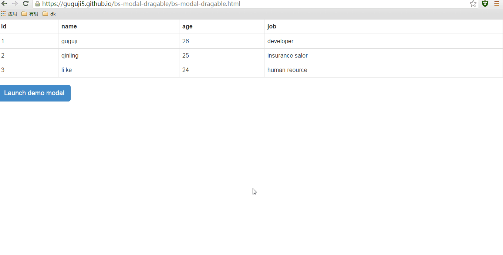
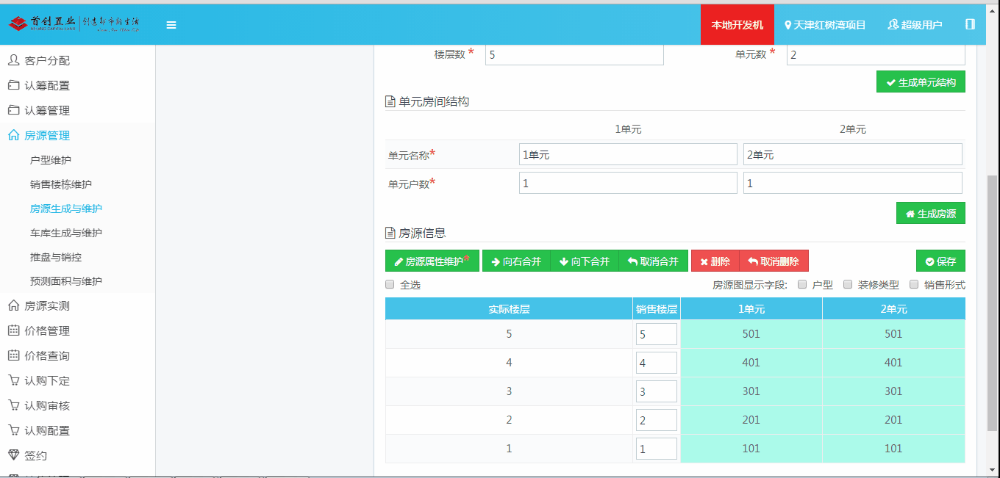

##bs-modal-dragable

项目中用的有点乱，jquery和angularjs一起搞，有些插件用的jquery版本的，有的插件用的ng版本的。搞到现在测试了一轮又一轮，发现modal模态框有限bug，因为层级的问题，modal框会被左侧菜单遮挡，需求就改成将modal框改成可以拖动的。
网上搜了搜，找到个blog发现基本功能是可用的。但是效果不太友好。问题有以下两个

- **拖动时候背后文字会被选中，很难看**
- **modal模态框会被拖出边框以外，很难看，而且可能拖不回来**
- **modal可多动但是鼠标指针没有任何的显示，不友好**

将上边三个小问题解决以后，基本就可以用了。

拖动选中的时候，主流的webkit和火狐浏览器可以通过样式来调整，而ie的浏览器用过一句简单的js解决。

```
 -moz-user-select:none;/*火狐*/
 -webkit-user-select:none;/*webkit浏览器*/
 -ms-user-select:none;/*IE10*/
 -khtml-user-select:none;/*早期浏览器*/
 user-select:none;
 //IE浏览器兼容
document.body.onselectstart=document.body.ondrag=function(){
  return false;
   }
```
拖出浏览器边界的问题，可以增加**碰撞检验**，再增加cursor：move的样式，就比较像模像样了。

[在线demo https://guguji5.github.io/bs-modal-dragable/bs-modal-dragable.html](https://guguji5.github.io/bs-modal-dragable/bs-modal-dragable.html)

根据我们项目中的情况，让他在content区域拖动，加了个**碰撞检测**，即将区域的边界根据实际情况来编写。


[下载demo自己调整 https://github.com/guguji5/bs-modal-dragable](https://github.com/guguji5/bs-modal-dragable)
